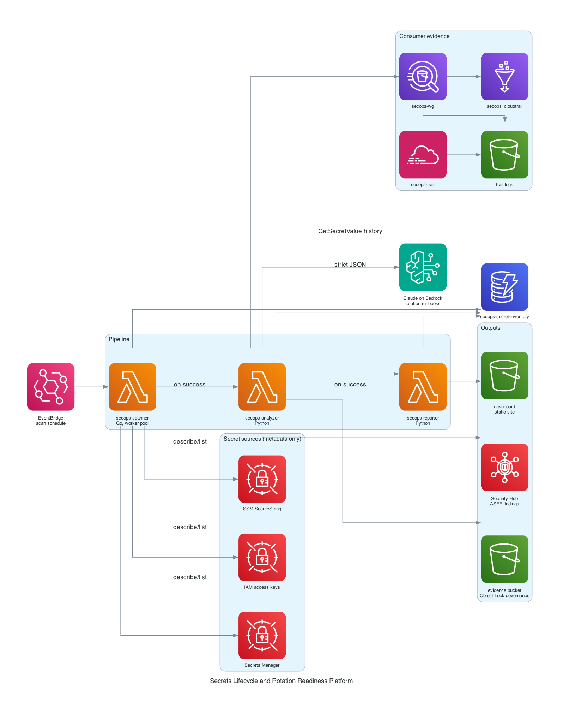

# Secrets Lifecycle and Rotation Readiness Platform

[](https://github.com/jordann6/aws-secrets-lifecycle/actions/workflows/ci.yml)

Production-style governance tooling for AWS secrets. AWS Config can already
tell you a secret is stale. It cannot tell you why nobody rotated it. The
real reason secrets age out is that no one knows which workloads consume
them, so rotation carries outage risk. This platform closes that gap and
produces auditor-ready evidence on the way out.



## What it does

1. **Scanner (Go Lambda)** sweeps AWS Secrets Manager, SSM SecureString
   parameters, and IAM access keys with a bounded goroutine worker pool,
   multi-account capable through assumed roles. It captures metadata only:
   ARN, creation date, last rotated, last accessed, rotation configuration,
   resource policy, tags. Normalized records land in DynamoDB.
2. **Dependency analyzer (Python Lambda)** queries 90 days of CloudTrail
   management events through Athena to build a consumer map per secret:
   which principals actually call GetSecretValue and GetParameter, and how
   often. It combines age, consumer count, consumer identifiability, and
   rotation configuration into a rotation readiness score, then asks
   Claude on Amazon Bedrock (model configurable, Claude Haiku 4.5 by
   default) to synthesize an ordered rotation runbook with a rollback
   path and confidence level for the highest-risk secrets. The model is
   prompted for strict JSON only and the parse is validated with one
   retry. If Bedrock is unavailable the analyzer degrades to a
   deterministic rule-based runbook, labeled generator=fallback so
   dashboards can tell the two apart.
3. **Compliance evidence layer** maps every finding to HIPAA
   164.308(a)(5)(ii)(D), SOC 2 CC6.1, NIST 800-53 IA-5, and CIS AWS
   Foundations 1.14 from a versioned config file, writes per-scan evidence
   artifacts to a versioned S3 bucket with Object Lock in governance mode,
   and pushes ASFF findings into AWS Security Hub.
4. **Reporter (Python Lambda)** renders a self-contained static HTML
   dashboard per scan, served from S3 static hosting with a bucket policy
   only. No CDN.

EventBridge schedules the scanner daily; Lambda on-success destinations
chain scanner to analyzer to reporter, passing the scan ID through.

## Security posture

- The scanner and analyzer roles carry an **explicit deny** on
  `secretsmanager:GetSecretValue` and `ssm:GetParameter*`, plus a
  `kms:ViaService`-scoped deny on `kms:Decrypt` for those services.
  Secret values are never read anywhere in the pipeline.
- A redaction layer scrubs anything resembling key material before data
  reaches logs, DynamoDB, or Bedrock, as defense in depth.
- Least-privilege roles per function; the evidence bucket accepts writes
  only from the analyzer role and denies insecure transport.

## Setup

Prerequisites: Terraform >= 1.10, Go >= 1.22, Python 3.12+, AWS CLI with
credentials for the target account, and Bedrock model access for the
configured Claude model (submit the Anthropic use case form on the
Bedrock Model access page once per account). Without model access the
pipeline still completes using rule-based fallback runbooks.

```
make build      compile the scanner, package both Python Lambdas
make test       Go unit tests plus analyzer and reporter pytest suites
make deploy     terraform init and apply all modules
make seed       create 15 to 20 test secrets, consumers, and traffic
make traffic    re-invoke consumers to add CloudTrail access events
make scan       kick off the scanner; the pipeline chains automatically
make report     re-render the dashboard for the latest scan
make destroy    purge evidence (governance bypass), remove seed, destroy
```

CloudTrail delivers management events with up to 15 minutes of latency,
so run `make traffic`, wait, then `make scan` for a demo with populated
consumer maps.

Note on ages: real creation dates cannot be backdated, so seeded
resources carry a `secops:simulated-age-days` tag. The scanner honors it
and marks those records `age_simulated` so demo data is distinguishable
from real telemetry.

## Metrics instrumented

Logged by the pipeline and shown on the dashboard per scan:

- Total secrets under management
- Mean and median secret age
- Percent of secrets with an identified consumer set
- Percent with a verified rotation path
- Scan wall-clock time and secrets scanned per second
- Control findings per framework

## Monthly cost estimate (demo scale, daily scans)

| Component | Estimate |
|---|---|
| Lambda (3 functions, daily) | < $0.10 |
| DynamoDB on-demand | < $0.25 |
| S3 (trail logs, evidence, dashboard, Athena results) | < $0.50 |
| CloudTrail (first copy of management events) | $0.00 |
| Athena (a few MB scanned per day) | < $0.10 |
| Security Hub (findings only, no standards, first 10k free) | $0.00 |
| Bedrock Claude Haiku 4.5 (up to 5 runbooks per scan) | ~$0.20 |
| **Total** | **~$1.15** |

Comfortably under the $15 target. Runbook synthesis is bounded by
`MAX_RUNBOOKS`; swapping in a larger Claude model raises only that line.

## Repository layout

```
terraform/modules/   iam, dynamodb, lambda-scanner, lambda-analyzer,
                     lambda-reporter, s3-evidence, securityhub, eventbridge
scanner/             Go source and unit tests
analyzer/            Python analyzer, evidence layer, unit tests
reporter/            Python dashboard renderer, unit tests
config/              versioned control mappings (YAML)
scripts/             seed.py, purge_evidence.py
```
